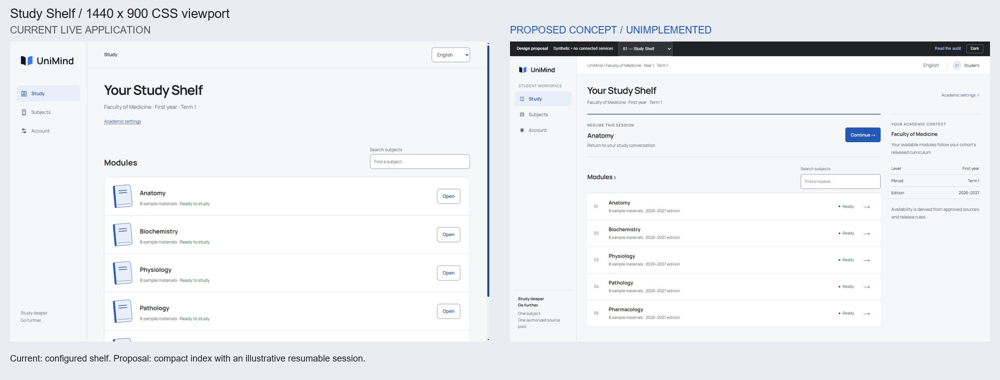
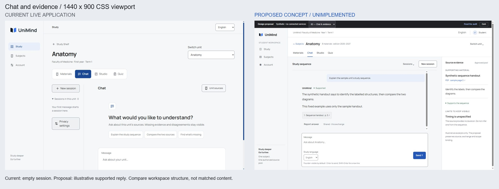
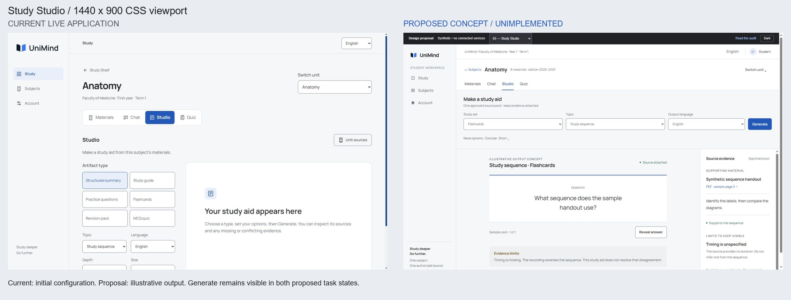
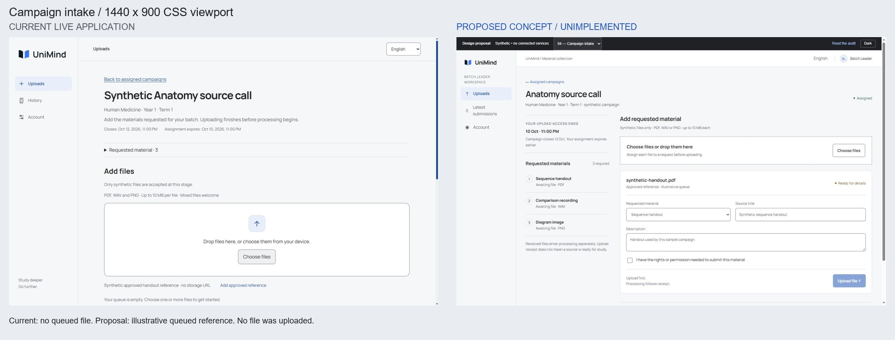
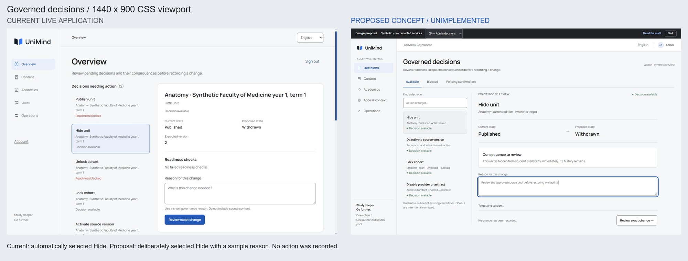

⚠️ DEGRADED: single-context (the user requested one agent; no independent assessors).

# UniMind — full-platform UI/UX audit and proposed redesign

4 October 2026 · source baseline `9f7d840ec9353c4c66e6d1e0e771de9acc76d866` · live application [project-xwrez.vercel.app](https://project-xwrez.vercel.app). **Read-only application phase. No redesign implementation, PR, merge or deployment is authorized by this report.**

## 1. Executive design verdict

**Overall product polish: 5/10.** UniMind has recognizable brand assets and functioning sample journeys, but the working product is organized around large page frames and explanatory templates rather than the tasks people came to complete. The landing's authored book metaphor does not become a comparably deliberate reading, collection and governance experience. The main weakness is composition: too much attention and space go to repeated context, equal-weight controls, generic resource explanations and sparse lists.

This is not evidence of a need for an architectural rewrite. The current semantic CSS tokens, Manrope/Noto Sans Arabic, Open Folio symbols, native inputs, source qualifiers and protected review seams are usable foundations. Their existence does not establish consistent task hierarchy. Better colors alone will not repair the product; more gradients, glows and animation would add noise to the same structural problems.

### Scores

Scores are design judgments about observed screens, not measurements or a WCAG certification. Accessibility and performance coverage are bounded separately. The synthetic accounts enter browser-only fixture state: these scores do not certify real backend workflows or claim that all platform capabilities were reachable.

| Dimension                    |       Score /10 | Observed reason                                                                                                                                                                                                                               |
| ---------------------------- | --------------: | --------------------------------------------------------------------------------------------------------------------------------------------------------------------------------------------------------------------------------------------- |
| Visual sophistication        |             5.5 | Folio landing is authored, but shelf, intake and Admin resources rely on large frames, repeated rows and ordinary panels with weak task-specific composition. p05, p13, p30, p37, p47.                                                        |
| Brand identity               |             6.5 | Open Folio and the bilingual type/paired themes are recognizable. The brand appears mainly as logo, slogan and repeated books; public 404 drops the identity entirely. p05, p13, p02.                                                         |
| Layout and hierarchy         |               4 | Fresh Chat Send sits below 900 px desktop; Studio Generate sits at 950 px. Mobile context/session chrome precedes the working task. Admin mixes blocked/available choices. p15, p16, p19, p37.                                                |
| Typography                   |               6 | Families and Arabic metrics are deliberate; shelf 40 px, unit/admin/campaign 36 px and repeated 24 px task headings spend hierarchy on framing. Citations/limits/results need stronger reading distinctions. p13, p19, p23, p26.              |
| Design consistency           |             5.5 | Shared tokens/shell exist, but confirmation, response quality, receipt and results use different hierarchy; title selection differs from campaign navigation; staff settings reuse Student content. p13, p29, p36, p38.                       |
| Navigation and usability     |               5 | Normal routes and returns are visible, but Study/Subjects overlap, Users is access context, History is latest-only and Admin preview changes the entire shell. Arabic brand-home resets to English.                                           |
| Motion and microinteractions |             5.5 | 180 ms control transitions and 240 ms flashcard flip exist; reduced-motion support is in source. Working-screen continuity and focus on meaningful state changes lag; Admin review focuses final Submit.                                      |
| Responsiveness               |             4.5 | Content generally reflows, but mobile stacks desktop hierarchy, and the 184 px tablet rail leaves a 574 px task area at 768 px. Send begins at 1251 px on fresh mobile Chat. p16, p21, p33, p41.                                              |
| Accessibility                | 6.5 provisional | Native labels, visible 3 px focus, keyboard flip and token contrast samples are present. Commit-focused Admin review needs correction; complete keyboard/screen-reader/reflow/time-limit proof remains missing. No invented contrast failure. |
| Overall product polish       |               5 | The product feels like a careful foundation with unevenly finished workflows. Study task entry, collection recovery and governance attention management are below the landing's visual promise.                                               |

### Critical findings

1. **The study tools make users navigate and scroll before they can work.** At 1440×900, Chat Message starts at 818 px and Send at 940 px; on 390×844, Message starts at 1068 px and Send at 1251 px. Initial Studio Generate starts at 950 px desktop. These exact geometry observations are the clearest reason to redesign the workspace rather than decorate it.
2. **Admin Overview lacks attention management.** It shows 12 candidates including blocked and already-applied states, automatically selects Hide unit, and focuses Submit this action when exact review opens. Existing readiness and version guards are essential; the front-end choice and review sequence should become deliberate.
3. **Collection prioritizes uploading over understanding the request.** Three required materials are collapsed, the drop area is prominent, and assignment expiry occurs two days before campaign closure with equal small-text emphasis. Needs-information status supplies no concrete repair path in the observed sample.
4. **Several navigation labels promise more than the reachable view provides.** Users leads to cohort/assignment context; History is latest-per-request; Usage capacity preview produces ordinary Chat because hosted fixture selectors are stripped. These are expectation failures, not merely aesthetic issues.
5. **Roles share a shell but insufficiently share a coherent experience.** The common chrome omits active role/actor, staff Account includes exchange-sharing settings, and Admin student-preview navigation loses governance context. Settings and feedback need consistent patterns with role-specific relevance.

There are **45 supported issues: 15 P1, 25 P2 and 5 P3; no substantiated P0**. [The issue register](issue-register.md) includes evidence, cause, impact, recommendation, effort and dependencies. Counts are not a target: false or duplicated criticisms were excluded. In particular, the inactive flashcard face is already aria-hidden, and semantic text colors sampled exceed ordinary-text contrast thresholds.

## 2. Coverage and evidence

All four supplied accounts were independently signed in and navigated. Student journey: academic setup→shelf→Materials→supported Chat→evidence/report inspection→generated flashcard→untimed Quiz→result→Account. Leader journey: assigned campaign→requested items→approved-reference queue→rights→memory receipt→latest status→Account. First Admin: queue→exact review/cancel→resources→preview→Account. Second Admin: fresh queue/blocked state→all resource destinations→in-memory campaign draft→Account. No final Admin command, external invitation, report or real registration was submitted.

The inventory contains 33 screen/state categories, 154 deduplicated observations and 59 retained screenshots. It does not establish complete evaluation of every route/state. [Screen-by-screen critique](screen-critique.md), [per-observation inventory](coverage-inventory.csv), [coverage manifest](coverage.json), [method and limits](method.md), [measurements](measurements.md), [pre-detector assessment](assessment-a.md) and [detector disposition](detector-review.json) retain the evidence. The inventory records CSS viewports independently from capture resolution and omits session selectors from URLs.

Mandatory viewport dimensions were used: 1440×900, 1280×800, 768×1024, 390×844. Landing, Studio, Leader intake and Admin queue were inspected across all four. Representative Light/Dark and Arabic states were sampled; full RTL/dark/landscape/physical-device/zoom coverage is not claimed. Early transition screenshots were discarded and replaced by settled images. Null screenshot entries remain discovery notes, not visual proof.

Meaningful gaps: dedicated Student source-detail route; timed Quiz expiry; all Studio output types; actual file transfer; external emails/invitations; cross-account pending second confirmation; source jobs/deletion evidence; real paid/provider/capacity conditions; real auth callbacks; screen reader and 200% zoom. Sign-out discards fixture state, preventing a faithful cross-account pending-action test. Public and synthetic screens are not a substitute for production-mode service acceptance.

## 3. Cross-screen consistency matrix

| Pattern               | Public/access                         | Student                                                          | Batch Leader                                   | Admin / Second Admin                                      | Worst discrepancy and fix                                                                                          |
| --------------------- | ------------------------------------- | ---------------------------------------------------------------- | ---------------------------------------------- | --------------------------------------------------------- | ------------------------------------------------------------------------------------------------------------------ |
| Global context        | Brand/text-language links; 404bare    | 232 px rail, 80 px utility; bottom 3 nav                         | Same shell, task labels                        | Same shell; mobile inline Menu+Account                    | 404and preview break continuity. Share error framing and explicit preview return; role context in utility.         |
| Task header           | Marketing display or auth panel title | Shelf 40 px, unit 36 px, then tool title                         | Campaign 36 px plus long explanatory header    | Overview 36 px, queue title, target title                 | Heading size tracks template, not task. Separate marketing scale from 28 px product heading/20–24 px task heading. |
| Primary action        | Strong CTA; Continue                  | Open/Send/Generate, often below fold                             | Choose files visually early; Upload later      | Reason→Review→Submit; no deliberate initial selection     | One action hierarchy, but task-specific placement. Keep work action adjacent to required input.                    |
| Navigation affordance | In-page anchor/demo controls          | Subject name selects; Open navigates                             | Campaign title/Open both navigate              | Queue selects; resource links navigate                    | Make navigation and selection explicit; titles should enter subjects unless labelled Details.                      |
| Data density          | Staged marketing composition          | Tall source/shelf rows; static Chat transcript                   | Big dropzone and padded file/history blocks    | Long repeated candidate list; summary pages sparse        | Reading, intake and operations need different density within shared tokens.                                        |
| Status/feedback       | Auth summary and inline error         | Reply support label, generic Notice score, plain evidence limits | Receipt and status paragraphs                  | Readiness cue, exact-change block, repeated Context/State | Consolidate status/feedback primitives; distinguish readiness, receipt, score, failure and source limitations.     |
| Settings              | Access route and recovery             | Academic/sharing/appearance/retention                            | Student sharing included without academic form | Same sharing/retention; actor absent                      | Role-relevant sections and explicit policy applicability; preserve privacy semantics.                              |
| Responsive behavior   | Hero stacks around Folio              | All unit/session controls stack; tool action low                 | Checklist hidden and file details stack        | Queue becomes one long select; Menu pushes content        | Device-specific task structure: tablet compact rail, mobile compact context and bounded panels.                    |
| Motion/focus          | Long assembly marketing exception     | 180 ms controls/240 ms flip; source reduced motion               | 180 ms drag cue                                | Review focuses Submit; abrupt context change              | Preserve useful local feedback, correct focus, omit global page-fade theatrics.                                    |

The redesign should share semantic rules, not impose the same dashboard on every role. Students need reading and evidence, Leaders need request coverage and correction, Admins need prioritization and exact consequence review.

## 4. Ten highest-impact improvements

Efforts overlap; this table batches related issues rather than summing every issue independently. Estimates exclude missing data/backend capabilities, final policy decisions and delivery gates.

| Rank / batch                                      | What's wrong and exact revised behavior                                                                                                                                                    | Screens / why it matters                                                                                     | Approximate effort                    |
| ------------------------------------------------- | ------------------------------------------------------------------------------------------------------------------------------------------------------------------------------------------ | ------------------------------------------------------------------------------------------------------------ | ------------------------------------- |
| 1. Rebuild subject workspace composition          | Compact unit context and tool nav; bounded conversation; composer visible; mobile sessions/context expand when needed. U01, U02, U38                                                       | All study tools. Makes the product usable immediately and restores reading width.                            | 3–5 days                              |
| 2. Make Admin attention and choice explicit       | Available/Blocked/Pending groups; truthful derived counts; no default Hide; exact target/state/consequence; safe review focus. U04–U07, U33                                                | Both Admin accounts. Reduces reading and accidental action pressure while preserving guards.                 | 3–4 days                              |
| 3. Put Studio output ahead of configuration       | Type/topic/language compact row, Depth/Size advanced, Generate adjacent; readable output and explicit evidence limits. U03, U21                                                            | Student Studio. Replaces a below-fold form/empty canvas with a coherent creation task.                       | 2–3 days                              |
| 4. Redesign Leader collection around requests     | Visible checklist/effective deadline; compact drop area; visible file→request mapping/title/rights; clear receipt→processing. U11, U12, U35                                                | Leader home/intake. Prevents wasted submission effort and wrong-deadline assumptions.                        | 2–3 days                              |
| 5. Give evidence a consistent place               | Desktop source panel/mobile sheet attached to exact exchange/artifact; keep full-page fallback and policy limits. U19–U21, U39                                                             | Materials, Chat, Studio, Quality preview. Makes strict grounding legible in use.                             | 2–3 days                              |
| 6. Standardize foundations and feedback           | Semantic type/surface/space/state tokens; shared Heading, Status, Notice, Field, Review primitives with native behavior. U36, U37, U43                                                     | Public + every role. Stops independent-template drift and makes later screens cheaper.                       | 2–3 days                              |
| 7. Correct navigation promises and context        | Study vsSubjects differentiated using existing resume state; Latest submissions and Access context; Admin preview return; role label; locale continuity. U08, U10, U18, U23, U25, U34, U45 | All roles. Users can predict destinations and identify their current context.                                | 2–3 days                              |
| 8. Turn the shelf into a usable index             | 28 px heading, 76–80 px rows, smaller folio markers, direct title links, conditional resume. U16, U17, U42                                                                                 | Student shelf. Five simple subjects become easy to scan without losing brand character.                      | 1–2 days                              |
| 9. Organize Account and access                    | Role-relevant sections; compact appearance; precise sharing/retention copy; password visibility; honest policy reading links and role-neutral continuation. U14, U24, U26–U31              | All roles and access. Removes generic reused content and gives sensitive choices a comprehensible structure. | 2–3 days plus approved policy content |
| 10. Finish responsive, result and recovery states | Quiz review as results; needs-information reason/allowed action; shared 404; honest unsupported operational states; purposeful focus/status transitions. U09, U13, U15, U22, U32, U40, U44 | Mobile/tablet, Quiz, Leader, Admin, errors. Removes the most visible signs of unfinished workflows.          | 3–4 days UI; capability work gated    |

## 5. Proposed design direction

### Identity: a serious study desk

Keep the approved Open Folio symbol, exact slogan, Manrope and Noto Sans Arabic. Use the folio idea functionally: main material, supporting evidence and task controls have distinct places. Blue marks selected context and primary action. Avoid adding visual effects to make fixed summaries appear more complete. The landing may retain its staged metaphor; working screens should emphasize reading, precise choices and source traceability.

### Typography

Use 28/36 px page titles desktop, 24/32 px mobile; 20–24/30–34 px task/section headings; 16/26–28 px reading body; 14/22 px dense rows; 13/20 px labels/metadata.12 px is reserved for nonessential metadata, not source limitations or required instructions. Weight 400 body, 550 labels, 650 headings. Latin heading tracking around−0.025em; body normal. Arabic uses its existing font with normal tracking and increased leading appropriate to the script; do not impose Latin metrics. Readable answer line length 60–72 characters, with evidence rail separate from answer text. Marketing display sizes remain a distinct approved surface.

### Color and surfaces

Retain Light canvas #f6f7f8, white surface, #202124 primary text, #535861 secondary text, #626873 muted text and #2458b8 action. Dark stays #1b1c1f canvas, #232529 surface, #eef0f3 text and #adc7ff action. Standardize semantic states: ready/accepted green, missing information amber, failed/blocked red, in-progress neutral/blue; always pair color with text and, where useful, an icon. Received and Ready remain distinct. Use 1 px separators for routine organization, borders for controls/group boundaries, and shadows for overlay depth. Corners: 6–8 px for controls/panels, 10 px for overlays. Remove unnecessary nested frames. Existing policy-required contrast overrides remain authoritative.

### Spacing and grid

Use the current 4/8/12/16/24/32/48 px scale with named composition purposes. Desktop shell: 200–216 px rail, 56–64 px utility, 24–32 px content padding. Tablet 768–1100:64–72 px labelled/icon rail with accessible names or an intentional drawer, 24 px content. Mobile: 16 px content, 52–56 px utility, compact unit context and 44 px tool navigation; preserve safe-area-aware Student/Leader bottom navigation. Keep product work width adaptive, with reading columns capped independently. Shelf rows 76–80 px; dense operational rows 64–80 px depending on label length. Do not artificially enlarge sparse screens to fill space.

### Navigation and component language

Separate navigation links, local selection and final actions. Subject title opens the subject; Details expands metadata explicitly. The Student Study destination offers existing-session continuation, while Subjects is the catalog. Staff labels describe available capability; no invented user directory or audit archive. Account is consistent and role-relevant. Admin preview announces scope and supplies Return to Admin. Preserve locale/context in every brand/nav link.

Shared components should include PageHeading, UnitContext, ToolNav, Button(primary/secondary/quiet/consequence), Field, Select, Disclosure, Status, InlineFeedback, EvidencePanel, EmptyState, ReviewPanel and DataRow. Keep native input/select/details behavior where adequate. Overlays require focus management, Escape, dismissal and full-page fallback. Do not import a component library merely to restyle these seams; CSS Modules and semantic React are sufficient.

### Motion specification

| Trigger                     | Duration / easing                                                 | Behavior                                                                 | Accessibility / reduced motion                                                          |
| --------------------------- | ----------------------------------------------------------------- | ------------------------------------------------------------------------ | --------------------------------------------------------------------------------------- |
| Button/row hover/focus      | 120–140 ms ease-out                                               | Color/border only; no magnetic motion or lift                            | Keyboard focus immediate; no transition under reduced motion                            |
| Evidence/session panel open | 160–180 ms cubic-bezier(.2, 0, 0, 1)                              | Opacity 0→1 and at most 8 px translate; backdrop 120 ms                  | Focus heading/first relevant control; Escape and focus return; reduced motion immediate |
| Local disclosure            | 140 ms ease-out if measured safely                                | Content reveal with stable surrounding anchor; native fallback immediate | aria-expanded via native control; no height animation under reduced motion              |
| Tool switch                 | 0 ms route navigation; optional 120 ms local state opacity        | Maintain context and move focus to tool heading; don't fade entire page  | Announce route/task; preserve keyboard position and reduced-motion immediate            |
| Generation/upload state     | Immediate status; 160 ms local reveal on completion               | Stable result slot, actual indeterminate state; no fabricated percentage | Polite status; no repeating flashy success animation; reduced motion immediate          |
| Flashcard reveal            | Retain bounded 240 ms flip only if user approves existing pattern | Clear Reveal/Show question state; inactive face hidden                   | Native button/Space/Enter; live-region summary; instant state under reduced motion      |
| Consequential review        | Immediate focus/context; optional 160 ms panel reveal             | Current/proposed/target/reason fixed in place                            | Initial focus summary or Cancel; no motion or focus nudging toward confirmation         |

This is an interaction prescription, not a recommendation for an animation library. CSS transforms/opacity plus React state are enough. Native browser scrolling and input behavior take priority.

### Accessibility and perceived performance

Target WCAG 2.2 AA through complete meaningful journeys: labels, headings, keyboard order, visible/unobscured focus, announcements, contrast, reflow and applicable timing adjustment. Product interaction target 44 px is stricter than WCAG's 24 px minimum with exceptions. Keep language/direction distinct for UI and study output. Validate Arabic long content and unbroken identifiers; do not hide exact target information to make a screenshot tidy.

Perceived performance improvements should stabilize content during auth/tool transitions, keep compose/actions in view and use task-shaped pending states. Skeletons should reflect real layout, not blanket every route. Measure actual browser metrics on an approved implementation; do not treat mock timers, automation waits or subjective smoothness as LCP/CLS/INP evidence. The inspected app returned no errors in one bounded console query; that is not an app-wide error-free certificate.

## 6. Five actual visual concepts

The [portable interactive proposal](concepts/index.html) and rendered previews are standalone documentation. They connect to no services and do not change UniMind. English concepts demonstrate composition; Arabic final copy and RTL need implementation proof. Differences in state are explicitly identified below so a generated/output state is not falsely presented as a pixel-matched before/after test.

| Concept               | Current evidence                                   | Concrete changes / expected difference                                                                                                          | Interaction demonstrated / scope                                                                                                               |
| --------------------- | -------------------------------------------------- | ----------------------------------------------------------------------------------------------------------------------------------------------- | ---------------------------------------------------------------------------------------------------------------------------------------------- |
| 01 Study Shelf        | p13 configured, no prior study                     | Compact rows and direct title links, stronger resume hierarchy, context in secondary column. Five modules become a scanable index.              | Search/no-match and Continue. Proposal includes conditional resume from existing lastStudyPath, so state differs from initial baseline.        |
| 02 Chat + evidence    | p15 fresh empty; p17 supported mobile              | Compact context, full reading column, attached source rail and bounded composer. Working action remains visible rather than below initial page. | Fixed sample send, new session, evidence dialog; no model. Proposed screenshot depicts existing supported-answer state, not fresh-empty state. |
| 03 Studio             | p19 initial config; p23 generated flashcard mobile | Configuration in compact row; Depth/Size advanced; output and evidence limits differentiated. Generate is immediately reachable.                | Options, fixed-output preview and Reveal answer. Proposed screenshot shows output state; source/limit content remains synthetic.               |
| 04 Campaign intake    | p30 empty; p34 reference queue                     | Visible required checklist/effective deadline, compact file choice, explicit destination/title/rights and receipt/processing distinction.       | Rights-gated receipt preview only. Queued reference is illustrative; no filechooser/storage service.                                           |
| 05 Governed decisions | p37 default Hide; p38 review                       | Available/Blocked/Pending, no default action, compact list and explicit state/consequence sheet; safe final review focus.                       | Deliberate selection/search, reason gate, review/cancel. Final record action is disabled; actor/version guards are not simulated.              |

The current screenshots remain in their original captured resolution; CSS viewport sizes are recorded separately because the browser capture may scale the image slightly. These are concepts, not implemented results. The prototype's limited navigation does not establish feature completeness. A real redesign's before/after proof must use equivalent states, viewport, locale, theme and source fixtures.

Proposal checks: Chat Send is visible at desktop, laptop, tablet and mobile sizes. At 390×844 it begins at 705 px, is 44 px tall and ends above bottom navigation at 780 px. Studio Generate begins at 325 px desktop and 370 px mobile. These rounded DOM measurements describe the prototype, not an application improvement already delivered. Mobile Admin uses a vertical selection list, then a separate detail view with an explicit return. Search/no-match, sample send, source dialog, flashcard Space activation, rights-gated receipt preview, Admin reason gate, Cancel focus and Escape/focus return were exercised. All five mobile concept layouts were checked for horizontal document overflow. English concepts and a dark Shelf sample do not establish complete accessibility or bilingual acceptance.

## 7. Implementation roadmap after explicit approval

The approved strategy should be delivered as coherent slices against the existing runbook, each with a controlled record. This proposal does not create implementation tasks, alter runbook status or pre-authorize backend changes. Indicative presentation-only work: roughly 15–22 focused engineering days, with design review and verification alongside each slice. Missing operational data/policy capability work is outside that estimate. Do not add the overlapping issue estimates mechanically.

| Phase                                  | Changes / affected seams                                                                                                                   | Dependencies                   | Acceptance criteria / validation                                                                                                                                      | Risks and regression concerns                                                                                                                      |
| -------------------------------------- | ------------------------------------------------------------------------------------------------------------------------------------------ | ------------------------------ | --------------------------------------------------------------------------------------------------------------------------------------------------------------------- | -------------------------------------------------------------------------------------------------------------------------------------------------- |
| F1 Foundations                         | Semantic type/space/surface/radius/status roles in globals/CSS; document approved direction and component contracts                        | Explicit founder approval      | Same brand/fonts/themes; shared samples in both languages; text/UI contrast, focus and long text checked                                                              | Token reach touches all roles; do not flatten source-limit/error meaning                                                                           |
| F2 Shell and context                   | AppShell, UnitContext/ToolNav, role label, tablet/mobile navigation, locale retention, branded 404, Admin preview return                   | F1                             | Four viewport sizes; correct current destination; 44 px product targets; compact context; route/focus/locale preserved                                                | Navigation state, preview identity, fixed-bottom safe area and source scope must not regress                                                       |
| F3 Shared task components              | Button/Field/Disclosure/Status/Notice/Review/Evidence/EmptyState/DataRow; access forms                                                     | F1, F2                         | Native semantics; pending/error/disabled/success; keyboard/Escape/focus-return; role-consistent feedback                                                              | Do not replace guards with visual disabled state or change consent/report/privacy semantics                                                        |
| F4 Student experience                  | Shelf/Materials/Chat/Studio/Quiz result; attached evidence with route fallback                                                             | F2, F3                         | Same fixture states; at 1440×900 and 1280×800 initial Message+Send and Generate visible; at 390×844 composer visible in task view; source binding survives panel/back | Input draft/session state, mixed-language text, mobile keyboard and exact exchange evidence                                                        |
| F5 Role-specific work                  | Leader checklist/deadline/queue/latest recovery; Admin status groups/deliberate choice/review; role settings; truthful resource labels     | F2, F3; F4 preview integration | Both Admins independently; no-op/blocked/pending categories accurate; exact reason/target/version; effective deadline correct; receipt not READY                      | Protected semantics unchanged. Real second-confirmation/stale-version tests in owning test seam; missing data remains an approval-gated capability |
| F6 Motion and status continuity        | Local panels, loading/result stability, flashcard, focus/announcements                                                                     | Stable F4, F5                  | Purposeful 140–180 ms local transitions; no route fades; actual reduced-motion preference; interruption/retry state                                                   | Unmount/cancellation, focus loss, forced scrolling, live-region repetition; no new animation dependency                                            |
| F7 Responsive and bilingual refinement | Tablet 64–72 px rail/drawer, mobile context/sheets, RTL/long text/landscape                                                                | F2–F6                          | 1440×900, 1280×800, 768×1024, 390×844 plus 320 CSSpx/200% zoom; no document overflow; unobscured focus; touch/keyboard-safe composer                                  | Physical keyboard/safe area, long Arabic labels, zoom, oversize dialog/identifiers and stacked file forms                                          |
| F8 Complete QA and visual review       | Equivalent before/after states, meaningful workflow tests, a 11y/performance observations, founder candidate review, normal delivery gates | F1–F7                          | All approved journeys pass; source/role rules unchanged; no material visual/interaction regression; exact-head required CI for delivery                               | Never mark a fixture result as provider/production proof; preserve earlier failures and exact source/evidence binding                              |

### Engineering boundary

Keep strict TypeScript/Next 16/React 19, CSS Modules, Supabase/PostgreSQL and existing adapters. No package/runtime rewrite or motion dependency is proposed. Relevant Next guides must be read before implementation. Shared foundations precede page-specific changes. Actual authorization, database state, durable history, provider budget, ingestion, raw deletion, source readiness and role membership remain in their existing domain/application seams.

A UI proposal may display available trusted session role, candidate state, source locator or requested-item status; it must not fabricate server authority from a browser selector. If a revised screen needs data not supplied by an existing approved interface—directory, history timeline, correction reason, incident events—it is an explicit capability proposal requiring founder approval, specification and its own rejecting tests. Styling should show the limitation honestly until then.

### How improvement will be verified

1. **Visual equivalence:** save before/after snapshots of the same role, state, viewport, theme, locale and fixture. Compare composition/action position, reading line length, hierarchy and cross-screen consistency; do not award success for merely different colors.
2. **Task efficiency:** verify first-use Chat/Studio actions are visible at the specified sizes; subject title enters subject in one activation; Leader sees all required items/effective deadline before adding; Admin identifies available work without reading blocked/no-op entries. Record geometry/steps, not fabricated user-study times.
3. **Behavior preservation:** repeat supported/unavailable/conflict and evidence/report flows, all approved Studio/Quiz states, intake receipt/recovery, Admin cancel/blocked/pending/stale/error cases through existing test seams. Both Admin accounts matter; test mocks must bind exact role/actor/session state.
4. **Accessibility:** keyboard-only journeys, screen reader, contrast, reduced motion, 320 CSSpx/200% zoom, long RTL and physical mobile keyboard. A screenshot alone cannot prove these.
5. **Perceived and actual performance:** confirm stable pending/result regions and responsive controls; measure browser metrics only on the approved runtime, with method/conditions retained. Compare network/console behavior to baseline without claiming mock timers as provider speed.
6. **Delivery:** focused stable-candidate proof first, exact-head required CI for authorized delivery, affected external proof afterward. User-scope and financial limits override the default lifecycle. Founder approves the actual material candidate before implementation delivery proceeds.

## Quality references and their specific use

[Linear's selection documentation](https://linear.app/docs/select-issues) illustrates explicit item selection and discoverable action context. Apply that precision to Admin's single governed decision, not bulk mutation or Linear's brand. [Notion's sidebar documentation](https://www.notion.com/help/navigate-with-the-sidebar) separates workspace context, navigation and collapsible organization; UniMind needs a much smaller version suited to its role tasks. [Vercel's Geist system](https://vercel.com/geist/introduction) is a reference for coordinated primitives and hierarchy, not a reason to replace UniMind's approved fonts. These are documented pattern references; no comparative performance benchmark or private competitor account audit was performed.

[WCAG 2.2](https://www.w3.org/TR/WCAG 22/) supplies the practical accessibility criteria. Recommendations are an inference from those documented patterns plus the observed UniMind workflows. No competitor identity is copied and no absent notification, chart, directory or billing feature is silently added.

## Approval checkpoint

Approve or revise the proposed direction, five concepts, priorities and presentation-only roadmap before implementation. This request comes directly from the mission's mandatory founder checkpoint. Previous UniMind design acceptance and D- 22 do not approve this new transformation. No application code will change until explicit approval arrives. Data/policy/authorization capability expansions require their own clearly named approval even if the presentation direction is accepted.

Questions skipped: generic skill follow-up questions are replaced by the user's explicit founder-approval checkpoint.
