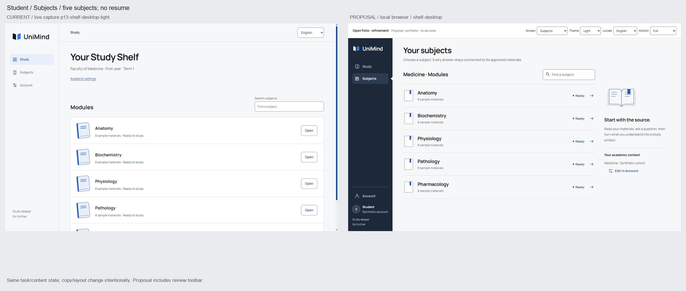
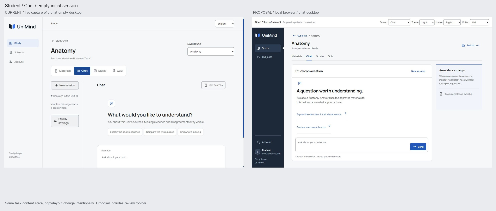
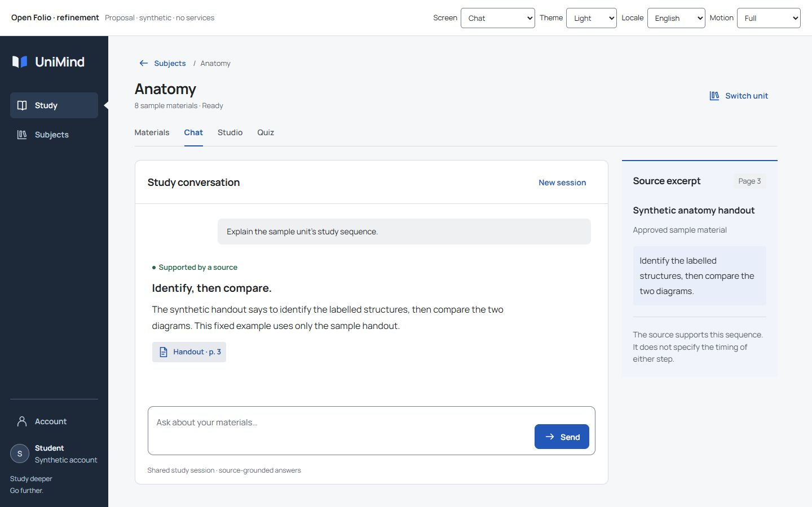
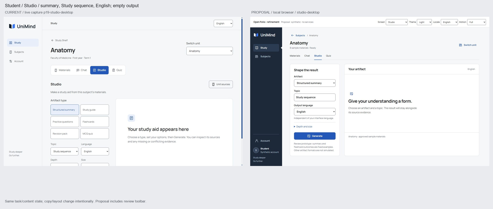
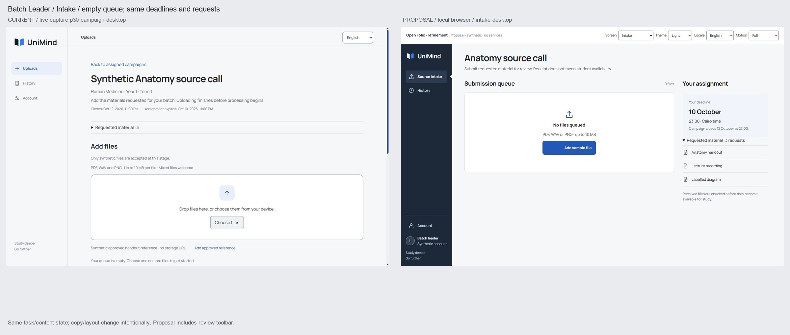
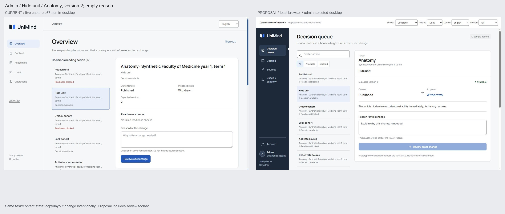
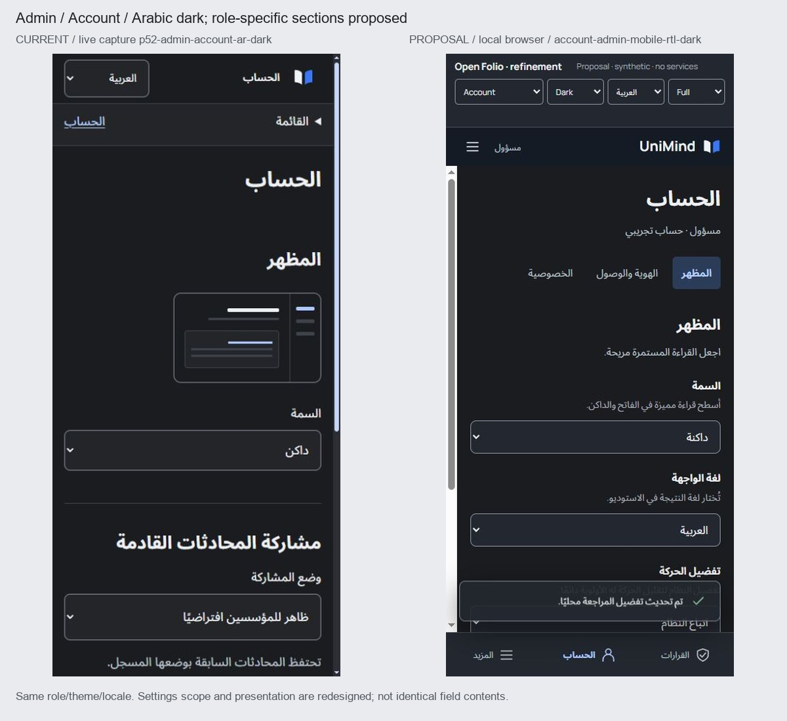
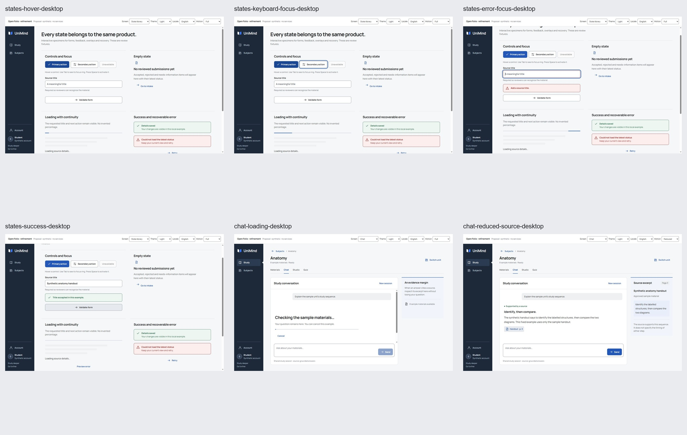

# UniMind design refinement — 5 October 2026

⚠️ DEGRADED: single-context (the user requested one agent; no independent assessors).

**Application code remains unchanged. Implementation is not approved.** This pass strengthens the first proposal rather than replacing the evidence-backed audit. The current-product [45-issue register](../issue-register.md), [33 screen critiques](../screen-critique.md), [154-observation inventory](../coverage.json) and original scores remain intact. The first audit independently inspected all four synthetic accounts. This refinement uses those retained live captures and source-verified fixtures; it is not a fresh full-platform live re-audit.

The first proposal solved important geometry and workflow problems, but it did not establish enough visual authorship. Grey chrome, repeated working grids, Unicode icon placeholders and mismatched before/after demo states made it look more like a functional refactor than a design transformation. [The adversarial assessment written before this build](assessment-before.md) records those weaknesses.

The refined direction is **Open Folio: reading and annotation**. It retains the serious-study foundation while adding a more recognizable relationship between navigation, subjects, reading, source evidence and operational decisions. It uses the existing brand assets, fonts and blue accent; the larger changes are composition, structural surface roles, visual rhythm, icon geometry and interaction continuity.

## What changed from the first proposal

| First proposal                                                                      | Refined proposal                                                                                                                                           | Why the change matters                                                                                              |
| ----------------------------------------------------------------------------------- | ---------------------------------------------------------------------------------------------------------------------------------------------------------- | ------------------------------------------------------------------------------------------------------------------- |
| Quiet grey rail shared by all screens                                               | Dark navigation spine in both themes, explicit role identity, selected-edge notch, compact tablet rail                                                     | Persistent identity and navigation now have a distinct structural plane instead of blending into every panel        |
| Mostly compact headings and smaller cards                                           | Collection-scale type, indexed subject rows, a reading surface with annotation margin, document-shaped artifact result and operational state ledger        | Different tasks gain different compositions; compactness supports the task rather than defining the whole aesthetic |
| Unicode navigation/utility marks                                                    | Coordinated authored 24-unit SVG icon set, 1.75-unit strokes, intentional direction mirroring                                                              | Shape, baseline and visual weight stop depending on platform glyph rendering                                        |
| A proposed resumed subject / generated result compared with an empty current screen | Same five subjects, empty Chat, initial structured-summary setup, empty intake queue, same Hide-unit action/version/reason state                           | The new evidence separates design gains from richer invented content                                                |
| Generic fades and restrained local transitions                                      | Signature citation-to-excerpt continuity, contained card turn, result settling, reversible dialog motion, clear stage feedback and a reduced-motion branch | Motion explains the relationship between a claim, its source and the user’s action                                  |
| Flagship screens carry the proposal                                                 | Account variants and shared state specimens are rendered; all 33 observed families receive an adoption plan                                                | Settings, validation, recovery and admin work must feel equally authored                                            |
| Dark/Arabic mostly sampled                                                          | Paired structural surfaces, a mirrored rail, Arabic type/labels, isolated identifiers and independent output language                                      | RTL and dark mode become actual design conditions rather than optional screenshots                                  |
| Motion and mobile refinement late in the roadmap                                    | Component states, responsive checks and motion tokens start with foundations                                                                               | Prevents visual and interaction debt from being left for the end                                                    |

## What the new product should feel like

Finding a subject should feel like consulting an organized index. The row is a real navigation target with enough metadata to choose correctly, not a decorative book cover requiring a separate Open button. The small folio marker repeats the brand’s geometry without competing with the subject title.

Studying should feel like reading with an available margin for evidence. The question and answer occupy the main paper surface; a citation opens a specific excerpt with its locator. The composer stays within reach. The blue annotation is a relationship between a claim and a source, not a colored card added for variety.

Studio should feel like configuring and evaluating a document. Input options sit beside the result on larger screens; on mobile, configuration and its primary action precede the output in a deliberate reading order. A result never appears by default simply to make the screenshot impressive.

Leader and admin work should feel like reviewing a ledger. Deadline, request, file, state, reason and consequence have different visual roles. Completion is sober and stage-specific. A received source remains processing/review pending; a governed review identifies exactly what could change.

Ordinary screens should inherit the same care through aligned fields, meaningful helper text, explicit role/context, durable error recovery and predictable modal behavior. They do not need a folio illustration or signature animation to belong to UniMind.

The complete type/color/layout/component/motion specifications are in [the proposed design system](design-system.md). These are unapproved deltas to the canonical contract. No new UI or animation library, framework, backend service or architecture is proposed.

## Updated visual concepts

The five desktop comparisons use the original live application on the left and an actual browser render of the disconnected proposal on the right. Frames are scaled proportionally for the boards; original captures are retained. The proposal review toolbar is visible and consumes 64 px desktop / 100 px mobile. It is not a product component.

### Subjects: an index with a deliberate visual edge

**Matched content:** Student; 1440×900; light English; the same five subjects and eight sample materials per subject; no resumed-session card. Before: p13. After: `shelf-desktop`.

Visual change: the dark spine, collection title, small folio markers and consistent row rhythm establish a stronger composition. The orientation margin explains the source-grounded study sequence and carries academic context at lower priority. All five subject choices remain visible on desktop.

Functional change: one row/title activation opens the subject; search filters the index; academic context has a clear account destination. Production resume remains conditional on existing `lastStudyPath`; it is not fabricated. The prototype opens the Anatomy fixture only; it does not prove all catalog routes.

Mobile counterpart: [matched mobile board](comparisons/01-shelf-mobile.jpg). The compact 78 px row keeps the title, count, readiness and direction together without becoming a stack of promotional cards.

### Chat: a reading surface with an evidence margin

**Matched content:** Student; 1440×900; light English; empty initial session, Anatomy and eight sample materials. Before: p15. After: `chat-desktop`. The new invitation copy is a deliberate copy/design change; it is not a fabricated prior exchange.

Visual change: a contained paper surface separates the reading task from the contextual source margin; the composer belongs to the conversation rather than a distant page footer. The unit/tabs stop acting like a second landing hero.

Functional change: Send is visible initially; the question survives cancellation/failure; a cited answer opens an exact local excerpt and receives focus without leaving the task. Desktop uses the margin; mobile uses a native dialog. Real exchange binding and route fallback remain implementation requirements.

The supported state is shown separately from the empty-state comparison. It uses the same fixed supported answer from the original audit, not an invented model response. [Matched mobile comparison](comparisons/02-chat-mobile.jpg); [Arabic dark source dialog](screenshots/chat-source-dialog-mobile-rtl-dark.jpg).

### Studio: document output, distinct from the controls that create it

**Matched content:** Student; 1440×900; light English; Structured summary, Study sequence, English output, concise/short defaults, empty output. Before: p19. After: `studio-desktop`. Depth/Size remain behind a disclosure in the proposal; default values remain equivalent.

Visual change: a compact configuration region faces a document-shaped output surface with its own reading hierarchy. Configuration and result are different roles, not identical cards. The empty result no longer consumes the page at the expense of its primary action.

Functional change: Generate is reachable in the first viewport; the existing six artifact choices remain visible. Only summary and flashcard outcomes are simulated in this prototype; other formats explicitly disclose their coverage limit. Output language is independent of interface locale. Cancel and generated state are local fixtures, not provider calls.

Mobile counterpart: [matched mobile board](comparisons/03-studio-mobile.jpg). The redundant Studio breadcrumb is removed on a phone, preserving unit name, tool tabs and subject navigation. [Arabic UI with English result](screenshots/studio-english-output-rtl-dark-laptop.jpg); [Arabic flashcard answer](screenshots/studio-flashcard-answer-rtl-dark-laptop.jpg).

### Intake: the earlier personal deadline and requirements lead

**Matched content:** Batch Leader; 1440×900; light English; empty queue, same Anatomy campaign/assignment, three requests, 10 October personal deadline and 12 October campaign close. Before: p30. After: `intake-desktop`. Heading and introductory copy are intentionally revised.

Visual change: the deadline gets an annotation plane and stronger date hierarchy; the queue is a working region rather than a giant dropzone. Request names form a readable checklist. The same meanings carry into phone layout.

Functional change: all request names remain visible before adding a file, including mobile; per-file destination is visible; source details and permission precede submission; local failure preserves details and rights; receipt explicitly leaves processing and student availability pending. Actual request selection, multi-file mappings and finalizer retry still require production workflow proof.

Mobile counterpart: [matched mobile board](comparisons/04-intake-mobile.jpg). [Retained-draft failure](screenshots/intake-error-mobile-rtl-dark.jpg) and [truthful receipt](screenshots/intake-received-mobile-rtl-dark.jpg) show two different states, not a generic success toast.

### Decisions: target context and consequences before commitment

**Matched content:** Admin; 1440×900; light English; Anatomy / Synthetic Faculty of Medicine year 1, term 1; Hide unit; Published → Withdrawn; expected version 2; empty reason; twelve action types. Before: p37. After: `admin-selected-desktop`. The screenshot selects Hide explicitly to match the baseline; the proposal’s actual initial state is unselected.

Visual change: searchable queue, selected state and a precise state ledger replace a long generic overview. Target and scope remain explicit. Current/proposed state have aligned baselines and a clear directional relationship; the consequence sits beside the reason-led review flow.

Functional change: no automatic destructive selection; noncommitting initial modal focus; searchable/filterable examples; a phone moves between queue and details with Back. The prototype reuses the existing twelve action-specific English/Arabic consequences. Readiness grouping/version are illustrative, not a second authorization implementation. Pending candidates and real counts are release requirements, not simulated proof.

Mobile counterpart: [comparison with disclosure](comparisons/05-admin-mobile.jpg). Current p41 is already scrolled; its reason is reproduced exactly in the proposal. This is equivalent action/version/reason content, **not identical scroll origin**. The [Arabic review dialog](screenshots/admin-review-mobile-rtl-dark.jpg) demonstrates target, state, reason and a noncommitting initial focus. No real command is submitted.

## Ordinary screens, dark mode and interactive states

Account is rendered for student, leader, Admin and Second Admin as a review-only variant. Appearance, identity/access and privacy have local section navigation; staff content no longer inherits student wording automatically. Role display is assigned context, not an editable access grant. The prototype’s role selector is clearly a review control, never a production role picker.

These are actual browser captures of hover, keyboard focus, required-field error, local success, pending work, reduced motion and modal review. The [interactive prototype](index.html) supplies the behavior; stills establish the states but do not prove frame pacing. No recorded video or measured animation smoothness is claimed.

Use the review toolbar to choose a screen, theme, locale and motion branch. In Chat, activate the example prompt, Send and its citation; preview an error and retry. In Studio, generate a summary or flashcard and press Space. In Intake, add the sample, edit details, confirm permission, preview interruption and retry. In Decisions, deliberately select Hide, enter a reason, review and cancel. These actions affect local synthetic memory only.

## Extending the system to every observed screen family

This table is a design adoption plan, not a claim that all these screens have been rebuilt. The prototype renders seven representative families; the original audit retains actual coverage for the platform.

| Observed families                                   | System extension                                                                                                                                                                       | Evidence-backed issues retained | Proof before release                                                                                                  |
| --------------------------------------------------- | -------------------------------------------------------------------------------------------------------------------------------------------------------------------------------------- | ------------------------------- | --------------------------------------------------------------------------------------------------------------------- |
| S01–S02 Public landing/workspace                    | Preserve the Folio hero/mark and existing product metaphor; add assigned-access/material context near CTA; explicit user-triggered claim/source demonstration, same buttons/type roles | U28/U41                         | Public→sign-in journey; mobile CTA; examples clearly illustrative; no invented testimonials/progress                  |
| S03–S05 Sign-in/register/recovery                   | Compact branded form plane; password visibility; native autocomplete; pending region; linked error summary; required-before-mismatch                                                   | U29/U30/U31                     | Keyboard, recovery and validation states; U31 blank-loading duration remains unverified                               |
| S06–S07 Commitments/academic setup                  | Readable policy content/version where actually supplied; role-neutral continuation; deliberate academic field group/summary                                                            | U26/U27/U28                     | All four role destinations and original consent/access controls preserved                                             |
| S08–S09 Shelf/subjects                              | Indexed collection, canonical row action, actual resume only; distinct Study and Subjects responsibilities                                                                             | U16/U17/U18/U42                 | Catalog/title/row/back/search journeys and real resume context                                                        |
| S10 Materials                                       | Compact source rows with title, format, locator, qualifier and readable details                                                                                                        | U19                             | Exact approved source identity and locator; long Arabic/source titles                                                 |
| S11–S13 Chat/evidence/reporting                     | Reading plane + exchange-bound annotation; bounded composer; contextual reporting dialog with return continuity                                                                        | U01/U02/U20/U36                 | Source binding, source-limit states, report payload contract and keyboard-safe composer                               |
| S14 Studio                                          | Artifact-specific reading structures, restrained source-limit notice, exact locator, independent output language                                                                       | U03/U21                         | All six types; unsupported/partial source limits; cancel/retry; no generic template flattening                        |
| S15–S17 Quiz setup/attempt/review                   | Setup fields share controls; attempt emphasizes question/choice; result separates score, selection, correctness and grounded explanation                                               | U22/U36                         | Actual quiz state/timing semantics, keyboard choices and source links; timed mode still requires dedicated assessment |
| S18 Student Account                                 | Section navigation, explicit academic context, privacy meaning, precise return-to-last-tool label                                                                                      | U24/U25                         | Appearance/privacy/context/return paths, without inventing durable history                                            |
| S19–S21 Leader home/intake/latest submissions       | Request/deadline/receipt ledger; requested/received/needs-attention summary from available data; reason-led correction; latest-only scope                                              | U11/U12/U13/U34/U35             | Multi-file request mapping, deadline boundary, interruption/finalizer retry; honest unavailable recovery              |
| S22 Staff Account                                   | Same field/surface language, role-appropriate sections, preserved settings for any existing study-preview exchanges                                                                    | U14/U23/U45                     | Admin and Second Admin independently; appearance/locale/home continuity; actor identity from approved session         |
| S23 Admin queue/review                              | Deliberate selection, Available/Blocked/Pending grouping and derived counts, exact target/version/reason/consequence/protection                                                        | U04/U05/U06/U07/U33             | All readiness/stale-version/second-founder states; no guard changes                                                   |
| S24–S27 Sources/campaign prep/catalog/cohort drafts | Object/status/next action as primary structure; administrative forms use the same field/review/feedback patterns                                                                       | U09/U36/U43                     | Existing data/contracts only; no false newly available workflows; form errors/drafts/review                           |
| S28 Users/access context                            | Label current capability Access context; source existing cohort/assignment facts; no invented directory                                                                                | U08                             | Capability-label match and role access; new directory separately approved                                             |
| S29–S32 Jobs/Quality/Usage/Incidents                | Operational fact rows and contextual severity; policy in secondary disclosure; clear unavailable states; preview keeps Return to Admin and exact scope                                 | U09/U10/U32/U39/U43             | No bogus capacity links; exact record/exchange only if available; role/scope preserved through preview                |
| S33 Public 404                                      | Shared compact brand shell, specific reason, Home/Back actions and same accessible control family                                                                                      | U15                             | Unknown route at desktop/phone; focus/title and return path                                                           |
| All families                                        | Same typography/status/button/field variants, deliberate tablet architecture, local purposeful motion, locale-preserving brand navigation and meaningful route metadata                | U23/U36/U37/U38/U40/U44/U45     | Four viewports, themes/locales, state inventory, real browser verification                                            |

## Functional improvement versus visual refinement

| Functional UX change                                           | Visual / experiential refinement                                | How to distinguish the evidence                                     |
| -------------------------------------------------------------- | --------------------------------------------------------------- | ------------------------------------------------------------------- |
| Initial Send/Generate visible; less context repetition         | Type scale and paper/control relationship                       | Geometry and task completion versus matched screenshots             |
| Direct subject navigation; actual conditional resume           | Folio index, smaller material marker and collection composition | Activation/back behavior versus density and hierarchy review        |
| Exact source excerpt with preserved question                   | Annotation plane and signature reveal                           | Exchange/locator binding versus composition/motion observation      |
| Effective deadline, visible requirements, recoverable receipts | Deadline typesetting and restrained ledger feedback             | Deadline/receipt semantics versus visual stage clarity              |
| Unselected queue, correct target/version/reason, safe review   | Decision ledger, queue selection and aligned state comparison   | Domain/keyboard proof versus cross-screen control/visual continuity |
| Role/locale/return context retained                            | Spine, role marker and paired dark surfaces                     | Four-account journey tests versus family/theme comparison           |

Prototype geometry already shows material improvement in the original action-placement problem. It does **not** establish improved completion time, fewer user errors, measured speed or a particular design score. Those require the release/usability proof in [the revised roadmap and acceptance contract](roadmap-and-acceptance.md).

## Adversarial critique of this refinement

1. **The dark rail could still be generic.** A dark sidebar appears in many products. The defensible UniMind difference is the complete spine/index/claim/source relationship. If only the rail is implemented, this proposal fails. Judge the source interaction, collection and ordinary forms together.
2. **The folio motif can become repetitive decoration.** The small book marker and the orientation diagram already approach the useful limit. Do not add book folds to modals, forms, badges or every empty state. Replace the orientation diagram with real helpful academic context if it stops helping first use.
3. **Empty states remain intentionally sparse.** They could still feel underdesigned on large monitors. Refine wording, reading measure and relation to the next action using actual content; do not fill the canvas with invented progress or decorative dashboards. Do not mistake the populated supported-answer frame for the empty-state improvement.
4. **The artifact result is not a universal template.** The prototype simulates only summary and flashcard output. Study guide, practice, revision and MCQ formats need their own compositional review. Applying the summary surface unchanged to every format would recreate the repetition problem.
5. **Operational target context is more valuable than visual compression.** The matched Admin concept retains Anatomy, cohort scope and version. Dense queues need scanning rhythm, but must not replace these with generic target labels or hide them in tooltips. Full pending/blocked/second-confirmation states are still unproved.
6. **Some interaction quality is still only specified.** The working prototype demonstrates fixed transitions and recovery, not streaming generation, long pending work, real session persistence or rendering under load. Its DOM replacement is a prototype technique, not proposed React architecture. Production must preserve focus/scroll/drafts without remounting the whole workspace.
7. **Mobile success on these fixtures is conditional.** The compact intake checklist and Studio action fit the requested phone viewport, including Arabic. Long translated titles, physical keyboard, landscape and zoom can still expose failures. The design needs an intentional scroll fallback, not more aggressive shrinking.
8. **Accessibility and motion need evidence beyond samples.** Token ratios and native focus/dialog examples do not prove full conformance. The detector degraded to regex and initially flagged a looping loader; the concept now caps it at two passes. Neither that fix nor CSS transforms prove smoothness on modest hardware.

To compete on craftsmanship with the strongest contemporary software, the next investment should be **content fidelity and behavioral completeness**: real source locators and excerpt lengths, long-title stress, artifact-specific typography, all operational outcomes, uninterrupted editing and exact role/locale continuity. More color, more animation and an additional library would not solve those remaining weaknesses.

## Review and approval

Read [the complete visual/motion system](design-system.md), inspect the five comparisons and interaction states above, then review [the revised implementation roadmap and acceptance criteria](roadmap-and-acceptance.md). [Evidence and verification](verification.md) separates demonstrated behavior from untested production conditions.

The original evidence-backed functional improvements remain in scope. The proposed spine, surfaces, composition, typography and motion are the added design ambition. Canonical design, application code, authentication/authorization, business rules, database behavior and deployments remain unchanged.

**Founder approval requested:** approve this refined direction and its scoped frontend roadmap, or identify revisions before implementation. Approval must be explicit. The current task stops at this checkpoint.
