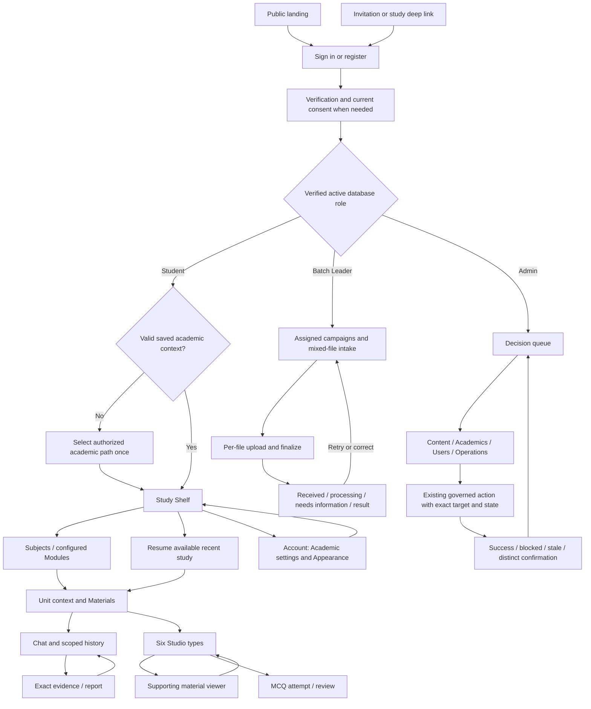

# UniMind frontend overhaul: Phase 1 audit and plan

**Current status:** Ahmed approved Phase 1 `ab568b6` and student implementation `3a2a95d`; see the [student receipt](../../planning/design/frontend-overhaul/student-approval.md). The [student record](../../planning/design/frontend-overhaul/phase-2-student.md) retains its proof; the [Batch Leader record](../../planning/design/frontend-overhaul/phase-2-batch-leader.md) retains the slice accepted at `4c03b80`; see the [Batch Leader receipt](../../planning/design/frontend-overhaul/batch-leader-approval.md). The [Admin record](../../planning/design/frontend-overhaul/phase-2-admin.md) owns the current implemented slice, focused proof and rendered checkpoint awaiting explicit approval. The findings below describe the audited predecessor, not a fresh defect list for the new implementation. [DESIGN](../../DESIGN.md) remains canonical.

Selected task **WP03-T09**, Ahmed, 30 September 2026. Baseline HEAD `c7b8679` on `codex/wp03-complete-synthetic-frontend`; local product checkpoint `fc95ebd`. PR #64 remains draft. This document is an audit/proposal, not design acceptance, task completion or live-provider proof. [DESIGN.md](../../DESIGN.md) is the canonical design contract. [Previous audit](../../planning/design/frontend-overhaul/previous-overhaul-audit.md) preserves historical findings and proof.

## Method, evidence and limits

Read README, master-plan 6–8, runbook WP03-T09/T10 and 6.1–6.6, current task/workflow/policy, PRODUCT/CONTEXT, frontend floor, design stack, skills inventory/guide, Impeccable new-work/audit/craft floor and pinned Web Interface Guidelines. Targeted reads cover actual route composition, guarded default services, role checks, synthetic state, profile schema, shared shells/CSS, source viewer, artifact/quiz/evidence/report flows, collection validation/progress/finalization and admin resources/actions.

The historical audit records 23 protected destinations, 42 prepared states, EN/AR at 1440/768/390/320 and sixteen inspected populated Chat/Studio captures. Its 23/23 native tests prove their exercised synthetic behavior; the ordinary E2E record is 50 passing plus one timeout with a passing focused replay, not a claimed clean 51/51 run. Those are source-bound historical proofs, not fresh whole-platform visual approval.

This Phase 1 adds direct in-app inspection of normal synthetic login/consent, resolved catalog, Anatomy overview, populated Chat with Arabic/English output, account, Batch Leader and admin surfaces, plus a separately rendered proposal. Fresh captures and observed checks are recorded in the [proposal review record](../../planning/design/frontend-overhaul/README.md). No real user/source data or external provider is used. Every new proposal image is inspected before presentation. Findings below distinguish observation, source contract and historical evidence; no unsupported WCAG health score is asserted.

## Capabilities to preserve

| Area                     | Existing capability / honest limit                                                                                                                                             | Owning seams                                                                                   |
| ------------------------ | ------------------------------------------------------------------------------------------------------------------------------------------------------------------------------ | ---------------------------------------------------------------------------------------------- |
| Identity                 | Working verified-identity, account, verification, consent, recovery and logout contracts; synthetic email/password/callback examples issue no session                          | `auth-actions.application`, `auth-access.application`, `verified-identity.server`, AuthForm    |
| Catalog                  | Caller-scoped availability, dependent hierarchy, invalid-child clearing, canonical URL hints; Module/Subject and flexible-credit terminology                                   | `catalog-journey.domain`, catalog Supabase adapter, StudyShelf                                 |
| Workspace                | Verified cohort/unit scope, source status/date/quota and scoped sessions; dedicated route layout                                                                               | `workspace.application`, Supabase adapter, WorkspaceFrame                                      |
| Study review             | Seven answer kinds; first Send; scoped histories/drafts; output-language independence; cancellation/retry; exact exchange evidence/report                                      | ProductChat/ProductStudy; full service implementations remain later WP06                       |
| Studio/quiz review       | Six types, topic/depth/size/language, progress/cancel, flashcard flip, timed/untimed quiz and grounded review                                                                  | ProductStudio/ProductStudy; generation/scoring/durable artifact services remain later WP07     |
| Material/evidence review | Titles/formats and fictional reliable locators/excerpts, evidence bound to selected exchange                                                                                   | ProductStudy sources/evidence; no original PDF/audio/download service is implied               |
| Collection               | Assignment expiry/scope, PDF/WAV/PNG byte detection, checksum/size/type/rights, per-item idempotency, upload progress/cancel/retry, finalize and tracking                      | CollectionFlow; collection domain/application/upload handler; storage remains mock/fail-closed |
| Governance               | Real audited publish/hide, unlock/lock, activation/quarantine/retry, holds/flags with readiness, state/version and verified-principal checks; synthetic examples do not mutate | AdminDecisionQueue; admin actions domain/application/Supabase                                  |
| Admin resources          | Eight normal resource routes with authorization and truthful unavailable state; simulation includes resource summaries/drafts                                                  | `/admin/[resource]`, ProductResource; broad real CRUD/invitation delivery is absent            |
| Account review           | Interface locale, future-sharing choice, reset-password path and contextual study return                                                                                       | ProductSettings; demo is document memory; no ordinary `/settings` route yet                    |

Neither logged-in UI nor a synthetic result proves live backend completion. Preserve existing guards, mock seams and rejecting tests instead of weakening them to fit a new composition.

## Route inventory

| Surface         | Current routes                                                                                                             | Proposed placement                                                                                                         |
| --------------- | -------------------------------------------------------------------------------------------------------------------------- | -------------------------------------------------------------------------------------------------------------------------- |
| Public          | `/` foundation report in ordinary mode; synthetic home redirects to login                                                  | Public landing; authenticated role-home routing                                                                            |
| Auth            | `/login`, `/register`, `/verify-email`, `/consent`, `/forgot-password`, `/reset-password`, `/auth/callback`                | One identity layer; compact form/step status; validated deep-link return                                                   |
| Student catalog | `/learn` with dependent URL hints                                                                                          | Study Shelf; Subjects listing filtered by saved academic preference                                                        |
| Unit            | `/learn/[cohortId]/[unitId]`, `/chat`, `/studio`, `/quiz`                                                                  | One current-unit header with Materials, Chat, Studio, Quiz                                                                 |
| Extended study  | Unit `/sources`, `/evidence`, `/report`, `/quiz/sample-attempt`, `/quiz/sample-attempt/review`                             | Preserve unit context and exact originating exchange/artifact/attempt; these are currently synthetic rewrites              |
| Account         | `/settings` in synthetic composition only                                                                                  | Account containing Academic settings, Appearance, language, existing sharing/account controls; compatibility URL as needed |
| Leader          | `/batch-leader`, `/batch-leader/campaigns/[campaignId]`; synthetic invitation route                                        | Uploads, History, Account; keep campaign URLs and expiry/assignment checks                                                 |
| Admin           | `/admin`, `/admin/{catalog,cohorts,campaigns,sources,jobs,quality,usage,incidents}`                                        | Group existing resources under five requested sections; retain URLs/deep links and queue                                   |
| Preview/runtime | `/preview/*`, `/preview/review` legacy notice, `/synthetic-runtime/[...path]` behind fail-closed explicit development gate | Preserve service isolation and guarded preview; standalone P1 artifact is not a new product route                          |
| API/status      | Auth callback, batch upload handlers, `/api/health/{live,ready}`                                                           | Unchanged except a proven minimal frontend-driven seam need in Phase 2                                                     |
| Failure         | Root/unit/campaign loading, error, not-found and synthetic prepared fixtures                                               | Role-correct PageState components with specific recovery                                                                   |

## Concrete findings

| ID / priority            | Problem, reproduction and evidence                                                                                                                                                                                                     | Correction / rejecting acceptance                                                                                                                                 |
| ------------------------ | -------------------------------------------------------------------------------------------------------------------------------------------------------------------------------------------------------------------------------------- | ----------------------------------------------------------------------------------------------------------------------------------------------------------------- |
| F01 P1 presentation      | Ordinary `/` exposes foundation/runtime/provider/release detail, no product explanation, preview or CTA (`src/app/page.tsx:8`)                                                                                                         | Public hero with exact slogan, actual approved UI preview, how it works, CTA/footer. Anonymous entry stays public; authenticated entry routes by verified role    |
| F02 P1 workflow          | Catalog setup dominates every initial shelf entry; no profile academic preference (`learn/page.tsx:67`, `profiles_roles_terms.sql:1`)                                                                                                  | One-time authorized onboarding; persisted validated profile hint; editable Account; refresh/new-session and cross-user denial tests                               |
| F03 P1 system            | Root CSS forces dark (`globals.css:8`); no theme selection/bootstrap                                                                                                                                                                   | Semantic paired themes; System/Light/Dark, pre-paint preference; actual computed contrast and loading/error/disabled review in both                               |
| F04 P1 consistency       | Shelf, auth, legacy workspace, revised Chat/Studio, collection and admin each own shells; identity/Settings repeats above the shelf and overview                                                                                       | One role shell/identity layer; preserve local scope nav. Compare role/route transitions, phone focus and RTL                                                      |
| F05 P1 mobile/navigation | Anatomy overview repeats breadcrumb/unit/edition/source/quota and switcher. At 390px the first meaningful action is far below the header. Its old five-link unit bar occupies four columns (`workspace-frame`, `workspace.module.css`) | One unit context; remove repeated scope/preamble; four local destinations, Sources presented as Materials. No clipped/hidden destination or fixed-bar obstruction |
| F06 P2 presentation/copy | Shelf footer “A calmer path to a brighter you.” and access “Trusted sources. Deeper understanding.” compete with the requested identity (`study-shelf.tsx:545`, AuthShell)                                                             | Exact two-line slogan and task-specific copy; no generic aspirational taglines                                                                                    |
| F07 P2 UX                | Catalog search is disabled before any units exist (`study-shelf.tsx:569`). It DOES filter after the path resolves, directly observed; old “dead search” finding is too broad                                                           | Preserve filtering; expose it when useful, otherwise explain setup prerequisite. Do not replace working search with a decorative field                            |
| F08 P1 intake            | Picker/drop consume only `[0]`, no `multiple`; mixed selection silently loses other files (`collection-flow.tsx:535`, `:571`)                                                                                                          | Per-file queue over current one-file seam; all supported selected files visible; individual failure/retry and no duplicate finalization                           |
| F09 P2 intake            | Requested item appears in both request rail and select; format is already inferred from bytes (`collection.domain.ts:30`)                                                                                                              | Unique scope/type match preselects item; ambiguous requested items require a choice. Keep rights/source metadata; never guess ownership/rights                    |
| F10 P1 completeness      | Admin resource links leave the task shell; ordinary resources are guarded notices (`admin/[resource]/page.tsx:87`), synthetic drafts look richer                                                                                       | Group existing resources in a stable console; visibly honest unavailable actions. No user CRUD/invite delivery/provider enablement invented                       |
| F11 P1 persistence       | Settings exists only under synthetic rewrite; preference/chat state resets intentionally (`product-services.tsx:57`)                                                                                                                   | Implement minimal real account preference seam for required academic settings; retain document-local demo isolation; do not claim demo proves persistence         |
| F12 P1 failure semantics | Catalog empty/no-membership falls through to “Assigned campaigns” (`product-native-page.tsx:411–417`, historical N08)                                                                                                                  | Correct student title/recovery EN/AR. Retry does not bypass membership; no hidden private diagnostics                                                             |
| F13 P2 visual weakness   | Several equally prominent panels/metadata grids turn overview/settings/admin into long preambles and a stack of generic cards; old workspace phone capture shows this clearly                                                          | Prefer useful rows and reading surfaces with one page/section hierarchy; expose next task before operational detail                                               |
| F14 P2 consistency       | EN/عربي buttons, links and full-name select coexist; icons and branding are duplicated in role components                                                                                                                              | One locale interaction and Brand/icon vocabulary; preserve drafts, output language and current scope; never mirror logo                                           |
| F15 P1 documentation     | Old briefs mandate navy palette, six tabs, expanding auth rail and palette-only extension; prior sample remains unapproved                                                                                                             | DESIGN governs new proposal; historical records remain clearly dated; no prior receipt reused as new design acceptance                                            |

Existing fixes worth retaining: first Send starts a session, interface-language changes keep draft/output language, distinct Cancel/Send identities prevent cancellation resubmission, only MCQ offers quiz progression, evidence rejects wrong exchange, and Account can return to the last study path. These were fixed in `fc95ebd`; do not relabel them as currently broken.

“AI slop” here is a design judgment tied to specific output: competing aspirational slogans, repeated unit disclaimers before the task, uniform icon-led cards instead of a clear work hierarchy, multiple identity treatments, and generic operations summaries in product context. It does not describe authorization or state-machine quality.

## Target information architecture and user flows

| Role         | Destinations and jobs                                                                                                                                                                                                                                                 |
| ------------ | --------------------------------------------------------------------------------------------------------------------------------------------------------------------------------------------------------------------------------------------------------------------- |
| Student      | **Study:** resume a valid current-unit session/artifact when available; current period. **Subjects:** authorized Modules/Subjects, useful filtering and readiness. **Account:** Academic settings, Appearance, interface language, existing sharing/recovery/sign-out |
| Batch Leader | **Uploads:** assigned campaign requirements, invitation scope, file intake queue and finalize. **History:** existing submissions/statuses by campaign, needs-information/rejected recovery. **Account:** appearance/language and existing account controls            |
| Admin        | **Overview:** decisions/blocked work. **Content:** Sources and Campaigns. **Academics:** Catalog and Cohorts. **Users:** existing assignment/access context only. **Operations:** Jobs, Quality, Usage and Incidents                                                  |

No user directory, role-assignment editor, source processor, commercial metric, calendar, Telegram, global knowledge pool or new product feature is added. A “Users” label cannot authorize a new backend capability.

Preserve URL role/scope validation, browser back/forward, selected material, output language, draft and originating exchange/artifact. Store only safe relative return paths and recompute authorization. No membership is created by onboarding, preview, a saved path or admin student-preview access.

## Persistence and backend budget

**Nothing changed in Phase 1.** Phase 2 is frontend-first with these bounded needs:

1. **Academic preference:** profiles currently contain `display_name`, `preferred_language`, `chat_retention_mode`, account status and timestamps. Add a nullable, versioned `academic_context` preference to that same profile, or equivalent smallest fields after implementation review. Prefer validated catalog identifiers, not duplicated names. A narrow caller-scoped application/server seam validates the configured stage→institution→program→level→period→cohort relationship against the authorized catalog before saving. TERM_BASED and FLEXIBLE_CREDIT preserve their existing period rules. No new profile/settings table.
2. **Reading preference:** local versioned theme key, validated values and before-paint application; no schema change needed. Reuse preferred-language field only through a safe existing/required account seam. Do not reinterpret retention as theme or academic state.
3. **Account routing:** read current active roles from verified caller-scoped `user_roles`, after the current account/consent gate. Choose the highest-authority existing assigned role for default home (Admin, then Batch Leader, then Student); preserve legitimate explicit role destinations. No role chooser, client-granted role or new permission. Do not change role-grant semantics.
4. **Resume:** reuse existing scoped session reads and synthetic `lastStudyPath`. If a real artifact/recent-study record is not exposed by an existing service, show available units without an invented “last studied” event. Do not build WP06/WP07 services in this frontend task.
5. **Batch queue:** compose existing per-file upload/finalize seam; byte detector already determines PDF/WAV/PNG. No bulk API, new format, worker, provider or processing schema is required. Keep each idempotency key stable during retry and recheck assignment on upload/finalize.
6. **Viewer/admin:** redesign presentation of existing excerpts/resource state. Real PDF/audio/download capability and broad management/invitation CRUD remain outside scope. Use current unavailable states where contracts are absent; no dummy live control.

Before preference/auth/storage mutation, apply trust-boundaries and record identity/scope inputs, recomputation, allowed/denied paths, revoked/stale behavior and exposure. Saved context cannot authorize a revoked/locked/unpublished unit. Tests must reject cross-user writes, forged catalog relationships, role parameters and stale access; synthetic state must remain per-document. Profile-only migration needs generated types, grants/RLS review and disposable database proof; no hosted data write or paid storage is necessary to approve the frontend.

## Design-document reconciliation

Scope of “every design-related Markdown”: all first-party current contracts, surface briefs, review guides, copies and design-history records discovered through Markdown path/content search. Vendored skill/reference-library DESIGN files are process/reference material, not UniMind contracts, and remain pinned. Historical task/evidence records preserve facts rather than retroactively changing approval.

| Document group                                                | Review / disposition                                                                                                                                               |
| ------------------------------------------------------------- | ------------------------------------------------------------------------------------------------------------------------------------------------------------------ |
| Root DESIGN                                                   | Replaced with explicit Phase 1 proposed canon; old contract archived without discarding provenance                                                                 |
| PRODUCT / CONTEXT                                             | Product facts inspected; PRODUCT's “no approved brand” wording reconciled with requested Open Folio dependency and missing files; domain terms unchanged           |
| Four `.impeccable/surfaces/*.md`                              | Current flow briefs refer to DESIGN; old comp/selection IDs retained only as historical baseline, no competing palette/navigation rule                             |
| `.impeccable/work/wp03-learn-surface-brief.md`                | Historical working copy points to the current canonical contract and live surface brief                                                                            |
| Shell/Chat/Studio work and finish review                      | Marked historical `fc95ebd` checkpoint; prior “ship” means presentation scope only, not this overhaul approval                                                     |
| Study Shelf asset manifest                                    | Historical provenance retained; image production no longer a requirement for neutral list design                                                                   |
| `docs/reviews/wp03-frontend-overhaul.md`                      | This current audit, contract map, role flows, sequence and limitations                                                                                             |
| `docs/reviews/wp03-synthetic-frontend-review.md`              | Existing app-review instructions remain useful; header points to current Phase 1 proposal/contract                                                                 |
| `public/demo-files/{frontend-overhaul,walkthrough,README}.md` | Static pack-era snapshots explicitly point to current docs; ZIP renewal deferred to approved stable implementation                                                 |
| Agent frontend floor / UI stack / skills guide                | Guidance reviewed; new canon references added to design stack where useful. No skill/policy adaptation is justified                                                |
| README / docs index / AGENTS / runbook                        | Authority/routes/workflow reviewed; entry/index/runbook continuation points to two-phase boundary, prior WP03 history preserved                                    |
| Logo concept README                                           | Read-only unrelated exploration preserved; its earlier no-selected-kit claim is historical. User names an approved dependency, but actual kit/guides remain absent |
| Historical WP03 task/evidence records                         | Reviewed relevant lineage and active task; no historical receipt or visual PASS rewritten as current acceptance                                                    |

## Prioritized implementation and checkpoints

| Order | Deliverable                                                                                                                                | Rejecting proof / checkpoint                                                                                                                                                                                     |
| ----- | ------------------------------------------------------------------------------------------------------------------------------------------ | ---------------------------------------------------------------------------------------------------------------------------------------------------------------------------------------------------------------- |
| 1     | Phase 1 audit, DESIGN reconciliation, role flows, separate rendered shell/student sample                                                   | Desktop/mobile Light/Dark EN/AR; source-bound findings; explicit **Phase 1 approval** before product edits                                                                                                       |
| 2     | Shared semantic tokens, native primitives, theme bootstrap and supplied Brand/icons; stable role shell                                     | Contrast/focus/keyboard/storage-denied/reduced-motion/RTL; kit proportions/theme/RTL inspected                                                                                                                   |
| 3     | Public/auth entry, real account academic preference, Study Shelf/Subjects and continuous workspace/Chat/Studio/viewer/quiz/evidence/report | Allowed/forbidden persistence/routing proof; no loss of six artifacts/session/evidence behavior; **student rendered checkpoint**                                                                                 |
| 4     | Batch Leader campaign intake queue/History/Account                                                                                         | Mixed PDF/WAV/PNG, ambiguous request mapping, per-file failure/retry/cancel/finalize, assignment expiry/revocation; **Batch Leader rendered checkpoint**                                                         |
| 5     | Task-oriented admin shell/resource grouping                                                                                                | Existing action/target/version/readiness/audit/financial gates, usable narrow-width detail; **Admin rendered checkpoint**                                                                                        |
| 6     | Product-wide consistency, state coverage, pack/walkthrough renewal, stable candidate review                                                | Both themes, EN/AR, 1440/768/430/390/360/320 plus 200% text; **final consistency checkpoint**; current founder receipt                                                                                           |
| 7     | Required broad proof and draft delivery workflow                                                                                           | Focused checks reused until invalidated; one guarded broad stable-candidate gate, exact-head CI, branch protection, affected production proof; T09 closure only when actual acceptance passes; T10 precedes WP04 |

Routine decisions are autonomous within this brief. Do not reopen WP00 or enable paid services to resolve presentation. Phase 1 approval and the supplied kit are now recorded; student, Batch Leader, Admin and final implementation checkpoints remain required. Financial exposure, access failure or a real architecture conflict is a separate genuine stop.

## Verification and out-of-scope record

During edits run the narrowest rejecting check. For accepted stable implementation use task-selected E2E/demo/security/contract tests, lint/typecheck/boundaries, review/diff/secret checks and the guarded broad gate. Profile changes add disposable database proof. A later invalidation repeats only affected proof. Exact-head CI is mandatory for delivery; this Phase 1 proposal is not a released application candidate.

State matrix for implementation: public/auth verification/recovery/consent errors; shelf unconfigured/no-membership/locked/no-ready/error; study empty/populated/stream/cancel/offline/quota/capacity/evidence-missing/report receipt; all six artifact outputs/progress/cancel; quiz timed/untimed/expiry/score/review; upload queue/type/size/checksum/rights/expiry/cancel/retry/received; admin denied/loading/empty/readiness/confirmation/stale/success. Review both themes and relevant direction for every changed role.

Unrelated/open issues stay separate: D-08 report/retention policy, D-18 storage references, paid provider/cap decisions, full admin editors/invitation delivery, real source viewing/generation and unchanged ordinary-runtime E2E timeout history. The previously missing Open Folio kit is supplied and integrated in Phase 2. No backend/schema/dependency/provider/worker change occurred in Phase 1; the minimal Phase 2 profile preference extension and its pending database proof are documented in the student record.
