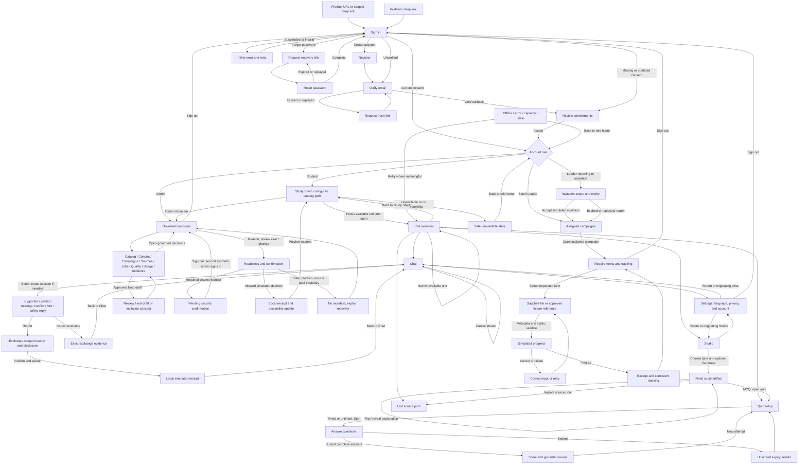

# WP03 frontend overhaul: audit, flows and implementation order

Selected task: WP03-T09. Baseline: `3347e15`, branch `codex/wp03-complete-synthetic-frontend`. Ahmed's 30 September 2026 instruction accepts the native synthetic flow, Study Shelf concept and palette, and rejects the execution. PR #64 stays draft/unmerged. WP04 stays on hold. This document is a working audit and plan, not a design acceptance receipt.

## Audit method and coverage

Read README, AGENTS, master-plan 6–8, runbook WP03-T09/T10, PRODUCT, CONTEXT, DESIGN, previous T09 plans/evidence, frontend floor, UI design stack and pinned Web Interface Guidelines. Inspect shared views, native composition, route guards, synthetic ports and existing tests independently. Use the actual loopback development runtime and normal forms; no review wrapper or role injection.

Baseline rendered route sweep: `/learn`; unit overview, Chat, Studio, Quiz, Sources, Evidence, Report, attempt and attempt review; Settings; Batch Leader campaign list, invitation and collection; admin queue and all eight resources. Repeat EN/AR at 1440, 768, 390 and 320px. Capture full-page images and visible-control geometry with `UNIMIND_FRONTEND_AUDIT=1 corepack pnpm test:e2e:demo` against the running 3101 demo. The local `.local/wp03-audit/baseline/` inventory preserves screenshots and measurements. Measurements flag candidates for inspection; intentionally scrollable rails, visually hidden file inputs and Next dev tools are not defects merely because they exceed parent bounds.

Journey coverage also includes registration, verification, consent, password recovery, seven answer kinds, evidence/report binding, six artifact types, timed/untimed quiz and scoring, privacy transitions, independent scopes, three file types/reference, checksum/type/rights/cancel/retry, twelve governed examples and distinct second confirmation, availability, stale/error/forbidden recovery, sign-out/role transitions and document/reload isolation. Existing tests are evidence for these exercised interactions, not evidence of polish. Individual failure states must be reviewed after their owning correction; baseline route images alone do not prove every populated or failed-state layout. The final rollout gate requires the full state matrix, not only empty-route screenshots.

Internal rendered inspection independently confirms excessive preamble and duplicate context in Chat/Studio; a disabled catalog search; inconsistent shell and locale treatments. The supplemental state matrix adds 42 prepared states × two languages × four widths: access, consent, valid/invalid recovery, thirteen study failure conditions, empty/no-membership shelf, five exercised collection failures, expired/replayed invitations, four exercised admin states and Chat/Studio progress/interruption. The driver uses only normal fictional login/consent, supplied files and simulated actions. Route/state measurements and local captures are retained under `.local/wp03-audit/`; selected review evidence is versioned separately. Earlier captures of a nonexistent recovery URL, unsettled consent/callback transitions and incorrectly asserted interruption are excluded. A passing harness assertion alone did not validate these pictures. The revised sample adds sixteen individually inspected populated Chat/Studio captures; this is sample proof, not a completed platform rollout.

## Product-flow map

Language switching is an in-place route transition: preserve query, selected scope, current session/artifact, entered values and focus; change interface language and direction only. Output language remains an explicit independent study choice. Browser Back follows history. Full reload deliberately clears the demo and returns through access; a different tab starts independently signed out. Neither is product persistence.

## Prioritized punch list

### Visual defects

| ID  | Priority / location                                | Reproduction                                       | Expected / correction                                                                                                             | Acceptance                                                                          |
| --- | -------------------------------------------------- | -------------------------------------------------- | --------------------------------------------------------------------------------------------------------------------------------- | ----------------------------------------------------------------------------------- |
| V01 | P1 workspace header and product study scope        | Open Chat or Studio                                | One compact scope header; remove repeated institution/unit/edition blocks; move metadata to overview/details                      | Composer or creation task visible in first desktop viewport; one scope control      |
| V02 | P1 `workspace.module.css` mobile navigation        | Open Sources at 320/390px                          | Five destinations currently use four grid columns; use a single adaptable navigation row or mobile disclosure                     | Every destination reachable, no second clipped row, 44px targets, focus visible     |
| V03 | P1 buttons across component CSS                    | Long Arabic action labels and narrow containers    | Intrinsic-width buttons with shrink/wrap rules; shared variants and icon sizing                                                   | No clipped text or container escape, including 200% text scale                      |
| V04 | P1 native account utility and embedded shells      | Open any signed-in view                            | One account/locale utility area; remove duplicated Settings/sign-out and identity layers                                          | Exactly one purposeful global account treatment                                     |
| V05 | P2 locale controls                                 | Compare shelf, workspace, resource screens         | One labeled, full-name English/العربية switch with selected state and bidi isolation                                              | Same appearance/keyboard behavior; route state and inputs retained                  |
| V06 | P2 repeated SVG implementations                    | Compare nav and actions                            | Shared 24px line-icon vocabulary, 1.8 stroke; separate direction-aware arrows                                                     | No emoji/text glyph substitutes; names for icon-only controls                       |
| V07 | P2 study form density                              | Studio at 768px                                    | Type choice leads; group options below; output has a distinct reading area                                                        | Creation and reading hierarchy remains clear on desktop/tablet/mobile               |
| V08 | P2 feedback and labels                             | Compare error/receipt/disabled states              | Shared feedback language and spacing; local concise simulation disclosure                                                         | Text plus state cue; live updates announced without repeated notices                |
| V10 | P2 brand placement across shells                   | Compare workspace, queue, resources and invitation | Different legacy badge/text/mark treatments fragment identity. Reuse the incumbent mark in the accepted shell, preserving artwork | Consistent placement/size; no logo artwork changes or replacement dependency staged |
| V09 | P2 source, quiz, collection/admin detail hierarchy | Open populated detail screens                      | Align title/action/metadata rhythm with accepted shell                                                                            | Consistent type/spacing; long metadata wraps; no arbitrary nested panels            |

### Interaction bugs and friction

| ID  | Priority / location       | Reproduction                                        | Expected / correction                                                                                                                              | Acceptance                                                                                                                                        |
| --- | ------------------------- | --------------------------------------------------- | -------------------------------------------------------------------------------------------------------------------------------------------------- | ------------------------------------------------------------------------------------------------------------------------------------------------- |
| I01 | P1 Chat composer          | Arrive with no sessions                             | First Send creates a scoped session; New session remains an explicit reset                                                                         | Can send immediately; empty/whitespace blocked; no cross-unit/session leakage                                                                     |
| I02 | P1 Chat transcript        | Send several questions                              | Transcript precedes composer; show fixed recognized prompt plus response; retain unrecognized text only in draft                                   | Reading order follows conversation; automatic progress and cancel/retry work                                                                      |
| I03 | P1 locale transitions     | Type then switch EN/AR                              | Keep draft/session/artifact and focus; current query preserved                                                                                     | Neither locale loses draft; output language remains unchanged                                                                                     |
| I04 | P2 Studio request         | Generate then navigate away/cancel                  | Explicit progress and interruption recovery; preserve completed artifact; no implied durability                                                    | Cancel never produces an artifact; completed unit artifact survives normal navigation                                                             |
| I05 | P2 Studio output links    | Generate a summary                                  | Only quiz artifact offers Start/Open quiz; every artifact offers source inspection                                                                 | No unrelated quiz action on every result                                                                                                          |
| I06 | P2 source evidence        | Open evidence without exchange or use wrong ID      | Explain missing context and offer Chat; exact exchange binding remains fail closed                                                                 | Recovery is usable; no previous exchange shown for forged IDs                                                                                     |
| I07 | P2 search                 | Open shelf                                          | Provide approved local catalog filtering or remove dead disabled input                                                                             | Every displayed input works or explains a genuine prerequisite                                                                                    |
| I10 | P1 admin failure recovery | Submit Hide unit with stale/error fixture           | Old confirmation and Submit remain alongside Reload. Disable/dismiss the obsolete confirmation until current state is reloaded                     | No apparently executable stale confirmation; reason retained; refreshed candidate reviewed before another simulated action; real checks unchanged |
| I09 | P1 Chat cancellation      | Send then immediately cancel by pointer or keyboard | Reusing the Cancel DOM node as Send changes its type during browser click default handling and resubmits. Give Send and Cancel distinct identities | Cancellation notice and draft persist; no late reply/evidence; retry produces exactly one reply; EN/AR pointer and keyboard                       |
| I08 | P2 failure controls       | Expired link, capacity, offline, empty              | Recovery action matches reason; Retry only for retryable states                                                                                    | No loop that grants forbidden access; safe role-home exit                                                                                         |

### Navigation problems

| ID  | Priority / location              | Reproduction                                                           | Expected / correction                                                                                                                 | Acceptance                                                                                                                   |
| --- | -------------------------------- | ---------------------------------------------------------------------- | ------------------------------------------------------------------------------------------------------------------------------------- | ---------------------------------------------------------------------------------------------------------------------------- |
| N01 | P1 mobile workspace              | Try returning to shelf/settings                                        | Desktop-only links are hidden by current bottom rail CSS                                                                              | Persistent mobile shelf/account access; all five local destinations reachable                                                |
| N02 | P1 role shell transitions        | Queue → resource → student preview → return                            | Admin queue and resource screens use different shells/nav sets                                                                        | Stable role navigation, explicit preview return, correct current location                                                    |
| N03 | P1 Settings return               | Open privacy settings from Chat                                        | Settings only gives home; no explicit origin return                                                                                   | Carry validated relative return path; return restores context                                                                |
| N04 | P2 unit switch                   | Switch from Chat to veterinary unit                                    | Existing select jumps to overview without clear task transition                                                                       | Label change explicitly; preserve current section where approved/available                                                   | Correct destination, no previous unit's exchanges/artifact |
| N05 | P2 source/report exits           | Traverse Chat → Evidence/Report                                        | Exit names and placement vary                                                                                                         | Consistent Back to Chat and source-pool navigation                                                                           | Keyboard/browser history and explicit exits agree          |
| N07 | P1 access rail after resize      | Open verification/consent at desktop width, then resize to 768/390/320 | Active stage becomes offscreen inside horizontal rail. Recompute active-stage position on reflow or use an accepted compact step flow | Active form and primary action remain visible/reachable after width/locale changes; keyboard focus reveals the correct stage |
| N08 | P1 student catalog failure title | Student `/learn?fixture=empty` or `no-membership`                      | Generic title falls through to “Assigned campaigns.” Map catalog failure to Study Shelf with role-correct recovery                    | Both locales announce the correct student location; no leader destination or implied assignment                              |
| N06 | P2 approved routes               | Inspect all role nav entries                                           | No Calendar/global Sources/Progress/personal uploads without policy                                                                   | Remove misleading entries; include only approved role destinations                                                           |

### Unresolved product decisions

| ID  | Owner / location                       | Decision required                                                | Interim correction                                                                    | Acceptance                                                            |
| --- | -------------------------------------- | ---------------------------------------------------------------- | ------------------------------------------------------------------------------------- | --------------------------------------------------------------------- |
| D01 | Founders, D-08 Settings/report         | Retention, exact qualifying report payload/disclosure and access | Clearly describe existing sharing rule; no invented retention/deletion control        | No fake policy selector; reports remain explicitly simulated          |
| D02 | Founders, D-18 collection              | Real approved storage-reference contract                         | Fixed supplied synthetic reference only                                               | No arbitrary URL acceptance or live storage access                    |
| D03 | Both founders, provider/usage          | Provider enablement, exact financial exposure and numeric caps   | Block enablement, show capacity state without fabricated limits                       | No paid call/resource/cap change                                      |
| D04 | Product owners, management/invitations | Broad editors and invitation delivery contract                   | Fixed draft concept; omit misleading Create/send controls                             | No real role/access/email mutation                                    |
| D05 | Ahmed or Ziad, checkpoint              | Accept concrete revised shell/Chat/Studio interaction direction  | Present interactive native sample after technical floor; await receipt before rollout | Candidate, actor, timestamp and scoped receipt recorded               |
| D06 | Separate logo owner                    | Approved versioned replacement asset                             | Current logo retained; no artwork diff in this task                                   | Asset version/provenance/approval recorded before a later integration |

## Ordered implementation and proof

1. **Audit and plan:** preserve prior task history; bind findings to baseline routes/source; publish this map and category-separated punch list. Dependency: product authority and working synthetic composition. Proof: baseline rendered inventory and journey results with explicit gaps.
2. **Concrete checkpoint sample:** retain palette/fonts/logo; implement shared controls/icon/locale primitives and one compact native unit shell; restructure Chat into session history + transcript + bottom composer, and Studio into type/configuration + reading area. Improve only sample-owned behavior. Dependency: audit. Proof: EN/AR/RTL, 1440/768/390/320, 200% text, keyboard, axe, overflow, direct Send, scoped history/evidence/report, all six types, interrupt/retry, draft-preserving locale transition, and isolation. Present sample in Chrome. **Wait for founder acceptance before extending direction.**
3. **Accepted system rollout:** apply accepted shell/control/navigation rules to access, shelf, Settings, quiz, sources/report, campaigns/collection and admin. Dependency: genuine checkpoint receipt. Retain real default ports/guards, fixture pack and useful tests. Proof: complete role journeys and per-state rendered inspection; regress each changed real WP03 seam with demo absent.
4. **Final candidate proof:** update walkthrough/pack, DESIGN confirmed system rules after acceptance, punch-list dispositions and coverage report. Review full diff/secret/scope risk; actual-diff route; preparation review/preflight; guarded verification. Dependency: stable complete candidate and current material acceptance. No route-only or inherited test result substitutes for populated/failure-state proof.
5. **Draft delivery:** update only PR #64, keep it draft/unmerged until revised candidate accepted and exact-head delivery gates pass. Logo work stays separately versioned. WP03-T10 owns final mock review; WP04 stays blocked. No production promotion or protected mutation from this review.

## Reference interpretation

Official public references consulted without external accounts or browser sessions: [ChatGPT Sources](https://openai.com/index/introducing-chatgpt-search/), [Claude artifacts](https://support.claude.com/en/articles/17153992-what-are-artifacts-and-how-do-i-use-them), [Gemini Canvas](https://support.google.com/gemini/answer/16047321?hl=en-GB). These support evidence adjacent to an answer and a distinct artifact work area. The proposed conversation reading order, quiet history and lower composer are design judgments for UniMind; no exact live competitor interface audit is claimed. UniMind retains its unit-scoped strict RAG, six approved artifact types and identity; no competitor web search, uploads or sharing behavior is imported.
